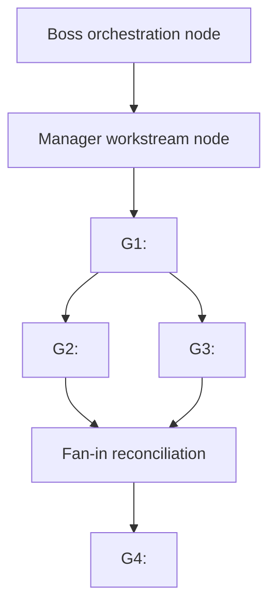

# Implementation Goal Graph

## Purpose

This document defines the implementation graph, orchestration rules, goal boundaries, verification expectations, and handoff/fan-in policy.

## Project Orchestration Composition

Owner:

Thread:

Orchestration registry:

Boss node and task:

Model/effort policy:

Allowed thread policy:

Integration branch:

Canonical tracker:

When delegation is active, every goal maps to an orchestration node whose launch spec supplies the exact title, immediate parent, trust ceiling, authority envelope, and completion profile.

## Graph Rules

Each node finishes only after:

- PR is merged into <integration branch>
- linked issue/PR evidence exists
- local verification evidence is recorded
- graph ledger is updated
- dependent nodes are unlocked, blocked, or superseded from current <integration branch>

Parallel nodes must have:

- disjoint or intentionally coordinated write boundaries
- stable dependency contracts
- independent verification
- explicit fan-in order or no order dependency

## Dependency Graph

## Node G1: <Title>

Objective:

Issues:

Execution mode:

Orchestration node ID:

Recommended model/effort:

Base:

Blocked by:

Blocks:

Write boundaries:

Dependency inputs:

Dependency outputs:

Scope:

Non-goals:

Exit criteria:

Verification:

Merged PR:

Merge commit:

Residual risks:

Fan-in / handoff:

## Node G2: <Title>

Objective:

Issues:

Execution mode:

Recommended model/effort:

Base:

Blocked by:

Blocks:

Write boundaries:

Dependency inputs:

Dependency outputs:

Scope:

Non-goals:

Exit criteria:

Verification:

Merged PR:

Merge commit:

Residual risks:

Fan-in / handoff:
